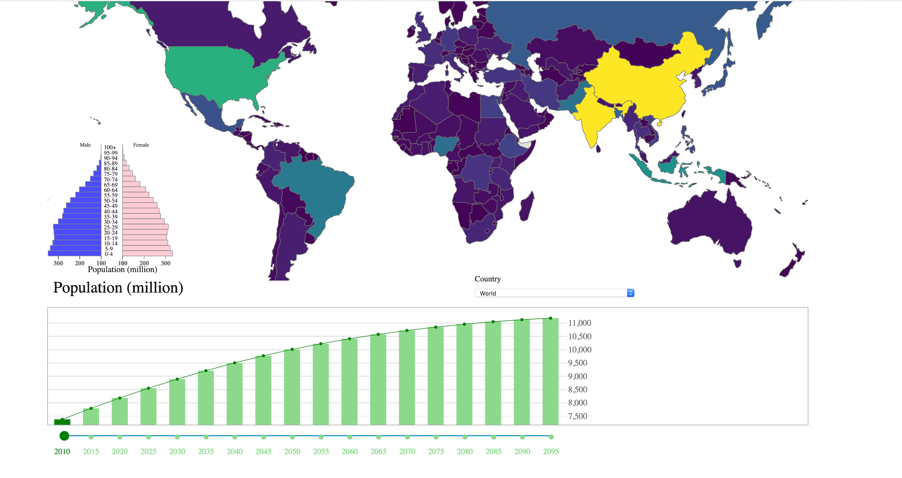
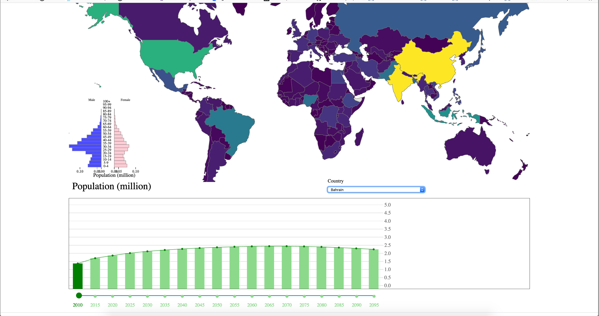
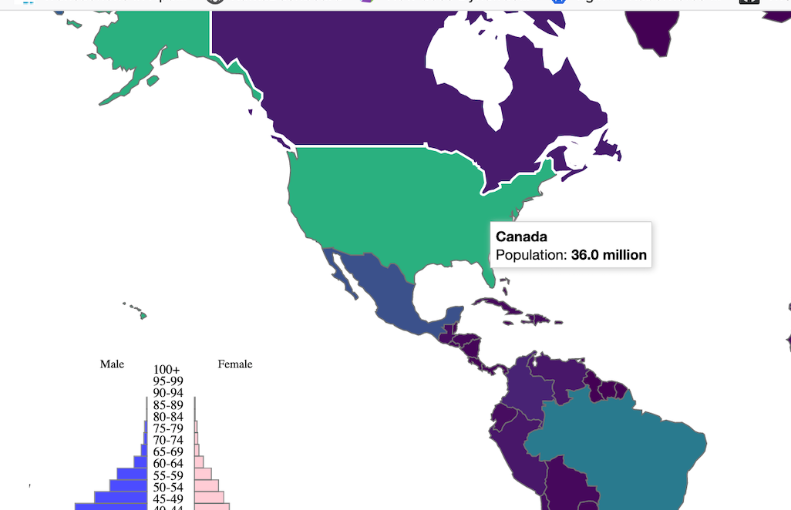
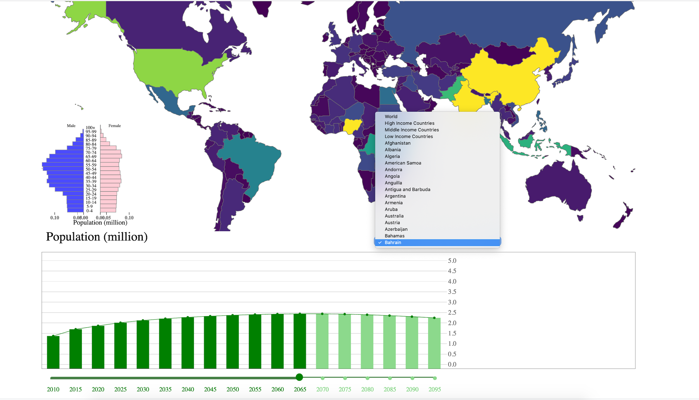

#Population Data

###Messaging. What is the message you are trying to communicate with the narrative visualization?

Population is trending upwards and this narrative explains how the world population is trending and how it would grow in future (2010 to 2100).  
The measure showing the number of dependents, aged 0 to 14 and over the age of 65, to the total population aged 15 to 64. This indicator gives insight into the amount of people of non-working age compared to the number of those of working age.

###NARRATIVE STRUCTURE:

The narrative structure in this visualization aims towards interactive slide show. On Landing page, user is presented with information about population trend, followed by a summary section. The third slide gives the information about population distributed across the world through the use of map, bar chart and pyramid chart. User can drill down by choosing options from various tools like drop-down menu, clicking on country on chart, slide through years that will change the scene and parameters.

###SCENES:

In the initial scene, information provided by United Nations Department of Economics and Social Affairs, is presented alongside the information collected from other sources with a prediction from famous scientist Stephen Hawking.  The subsequent slide provides user with brief information about the world population trend and drill down approach. 
The last slide displays the population for year 2010 through map, pyramid graph and the bar graph. User is presented with the tools like slider (to change years), bar graph, drop-down menu besides clickable map.  Tool tip on the map shows population by country, pyramid graph shows male and female population distribution by age and bar graph where x-axis represents the year and y-axis represents the population number in millions.

###ANNOTATIONS:

For annotations, tooltip is used to present the information on mouse-over action. This is available on map and bar chart.

###PARAMETERS:

X-axis and Y-axis on the pyramid chart and bar graph, SVG dimensions and ranges, color modulation, circle on line graph on bar chart. These parameters change corresponding to the user selection.

###TRIGGERS:

The trigger is the on-click action on world map that will auto-select the country & display information for that. Another trigger is the drop down that is available to choose different values which displays information by different categories like 'high income countries', ‘income countries’, 'low income countries' and individual country. By clicking any country in the map or selecting in the country selector (right bottom of the map) , the age pyramid and the bar chart on bottom will change according to user selection. Slider is present to change year, by dragging the bottom year bar or clicking the bars in the bar chart, you can select the year you want, and the map will change according to your selection.

